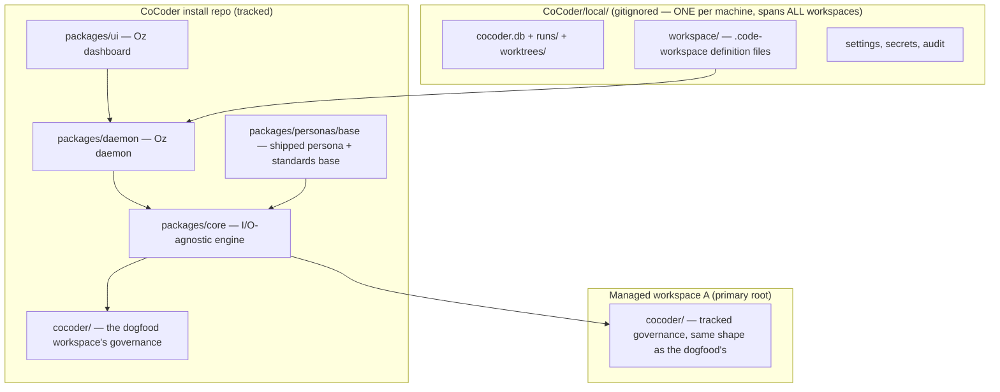

# CoCoder Architecture

**Status:** v2 (rebuild) — live  
**Last verified:** 2026-06-21 (architecture reading contract — [ADR-0031](./cocoder/decisions/0031-architecture-reading-contract.md); the live commit spine is [ADR-0023](./cocoder/decisions/0023-workspace-commit-spine.md) plus [ADR-0029](./cocoder/decisions/0029-founder-trusted-pre-run-snapshot.md): direct-to-branch, one mode, founder WIP snapshotted before launch; committed work is on the checked-out branch by construction)

## Mental Model

CoCoder has **three storage zones** that must never be conflated. The current topology read is
[ADR-0008](./cocoder/decisions/0008-repository-topology.md) plus
[ADR-0012](./cocoder/decisions/0012-living-base-personas.md),
[ADR-0019](./cocoder/decisions/0019-multi-root-workspaces.md),
[ADR-0027](./cocoder/decisions/0027-workspace-storage-contract.md),
[ADR-0030](./cocoder/decisions/0030-retire-spike-genre.md), and
[ADR-0032](./cocoder/decisions/0032-retire-playbooks-genre.md): repository homes, living base personas,
multi-root workspace identity, workspace storage, and the retired standalone `spikes/` and base
`playbooks/` genres.



| Zone | Location | Tracked in git? | Purpose |
|------|----------|-----------------|---------|
| **Install (public)** | CoCoder clone — `packages/`, `docs/`, `templates/`, `scripts/`, `cocoder/` (dogfood governance) | Yes | The engine, the shipped persona/standards base, the dashboard, public docs — and the dogfood workspace's own governance |
| **Install (private)** | `<CoCoder>/local/` | **Never** (only its signage `README.md` is tracked) | ALL machine-local state, spanning every managed workspace: the operational DB, run artifacts, per-run worktrees, workspace definition files (`local/workspace/`), settings, secrets, audit logs — survives `git pull` |
| **Workspace (tracked)** | `<primary-root>/cocoder/` | Yes (committed to that repo) | That workspace's governance: priorities, decisions, tickets, memory, standards extensions, persona extensions — community-visible |

**There is no per-workspace "local" zone.** A `cocoder/` governance directory is fully git-tracked
and never contains machine state; everything machine-specific lives in the install's one `local/`.

### The dual nature (CoCoder building itself)

The CoCoder repo is two things at once: the **engine install** every workspace shares, and the host
of one particular workspace — the **dogfood**, whose primary root is CoCoder itself. So
`<CoCoder>/cocoder/` is simply the dogfood workspace's governance directory, structurally identical
to the `cocoder/` directory any managed repo gets. For the dogfood, "product decisions" and "build
decisions" are the same set, so they share one `cocoder/decisions/` tree. An adopter's repo carries
*their* product's ADRs in *their* `cocoder/decisions/`; CoCoder's ship here.

### Multi-machine sync

`local/` is not in git, but it **lives inside your CoCoder folder**. Sync the CoCoder directory across machines the same way you sync any dev environment (Syncthing, iCloud Drive, a private dotfiles repo, etc.). Git updates the engine; your sync tool keeps `local/` aligned across laptops.

## How work reaches trunk — the commit spine (ADR-0023 + ADR-0029)

There is exactly **one** way tracked files reach the active workspace branch: the **commit spine**, a
single `core` service every actor calls — Oscar's wrap edits, Bob's verified atom, Deb's repair, Oz's
repair, the daemon's priority/persona/governance mutations, and any founder-directed edit. No actor
reimplements `git commit`. (This replaces the three divergent commit paths the 2026-06-14 audit found —
`runCommitGate`, `commitGovernance`, `gateCommitRepair` — which is what had been stranding work.)

There is exactly **one mode** (ADR-0023 Amendment 2, founder directive 2026-06-15 — the opt-in isolation
lane was removed). The spine always: works on the **active checkout / active branch** (no worktree, no run
branch, no landing step); commits **everything the actor changed** in one commit — the
[ADR-0007](./cocoder/decisions/0007-write-scope-enforcement.md) allow-list is **advisory**, out-of-lane
paths are committed and **flagged**, never withheld; applies **verification in place** for code; and emits
**one durable receipt** (commit-link + event: branch, SHA(s), changed files, out-of-lane flagged files,
verification evidence).

**Launch self-heals ALL founder dirt — the founder is a trusted actor
([ADR-0029](./cocoder/decisions/0029-founder-trusted-pre-run-snapshot.md), superseding
[ADR-0024](./cocoder/decisions/0024-governance-pre-run-snapshot.md)'s builder-dirt refusal).**
The direct-mode launch guard partitions uncommitted in-scope files by owner and snapshots each to its own
attributed commit before the run, then proceeds: **builder/product** dirt (`packages/**`) →
`founder: pre-run WIP snapshot` (founder's git identity); **governance** dirt (the `cocoder/**` / docs /
`ARCHITECTURE.md` surfaces) → `governance: pre-run snapshot` (cocoder-governance). Mixed dirt produces both
snapshots and still proceeds. So neither authoring-then-launch nor hand-editing product code can ever be
blocked by the founder's own uncommitted work (the run_91–96 strand class *and* the founder-WIP block are
both gone). The guard never destroys or mixes founder work: quarantine already excludes launch-time dirt,
and the snapshot keeps founder WIP out of agent atom commits. The pre-`0029` hard-stop refusal is preserved
behind the explicit `strictPreRunDirt` opt-in (CLI `cocoder run … --strict-dirt`) for shared repos / CI.
This is the **founder-vs-agent boundary**: governance gates bind *agents* (verify gate, quarantine,
out-of-lane flagging stay hard); the *founder's* work is preserved, never blocked.

**Atomic authoring Plays ([ADR-0025](./cocoder/decisions/0025-atomic-authoring-plays.md))** use the same
spine for `create` / `edit` / `archive-priority`: authoring validates, writes, and commits as one
governed action instead of creating a second mutation path. For the current commit-spine read, use
ADR-0023 and ADR-0029. ADR-0024 still owns the governance pre-run snapshot remainder; ADR-0025 owns
authoring Plays. ADR-0015/0021/0022 are retired history tracked in the
[ADR index](./cocoder/decisions/README.md).

| Change kind | Path | Verification |
|---|---|---|
| Governance / docs / ADRs / priorities / personas / standards | **Direct to the active branch** — commit in place | light / none (can't break a build) |
| Product / machinery **code** | **Direct to the active branch**, but the orchestrator verifies *before* the spine commits (per-atom diff + tests); fail → revert that atom in place, commit nothing | risk-matched ([ADR-0013](./cocoder/decisions/0013-orchestration-observation.md)) |
| Shared GitHub repo | The founder checks out a feature branch; the engine commits to it and `git push`es (**non-gating**). The merge to the shared `main` is GitHub's **PR review**, not the engine's | per the repo's CI / PR gate |

**Why this is safe with one mode:** the single-writer-per-workspace lock
([ADR-0004](./cocoder/decisions/0004-process-architecture.md)) serializes all writes, so in-place
quarantine (`restoreToHead`) can only ever touch the one actor's own uncommitted work; and "git is the
undo." **Why it ends the drift for good:** there is no run branch on *any* path — so no off-trunk place for
committed work to strand. The F14/F17/F19/F20/**F22** strand class is gone by construction. There is no
`pending-landing`, no held-back queue, no manual recovery: work commits to the checked-out branch, always.

## How a run executes — the orchestration loop (ADR-0013 + ADR-0016 + ADR-0017 + ADR-0026)

The current run loop is [ADR-0013](./cocoder/decisions/0013-orchestration-observation.md) plus
[ADR-0016](./cocoder/decisions/0016-deb-scoped-repair-fallback.md),
[ADR-0017](./cocoder/decisions/0017-oz-orchestration-persona.md), and
[ADR-0026](./cocoder/decisions/0026-onboard-existing-as-oscar-priority.md). Superseded predecessors
such as the 0020-addendum phase-executor are history, with status owned by the
[ADR index](./cocoder/decisions/README.md). This section is the current-state narrative; the per-contract
owner drill-down lives in
[`docs/orchestration-contract-ownership.md`](./docs/orchestration-contract-ownership.md), and landing
flows through the [commit spine](#how-work-reaches-trunk--the-commit-spine-adr-0023--adr-0029).

Oscar drives an ordinary priority as a multi-atom loop: scope the next atom, delegate it to Bob, wait for
Bob's completion marker, run the verify gate on the real diff and evidence, then either reject the atom
or let the spine commit it and continue to the next atom or wrap. The old verify-gate ADR-0011 is folded
into [ADR-0013](./cocoder/decisions/0013-orchestration-observation.md): no Oscar pass means no atom
commit, and "green" means evidence from the actual artifact, not a builder summary.

Observation is tiered by the **direct your primary** rule. Oscar monitors and directs Bob for the active
run. Deb monitors Oscar, may observe Bob to diagnose, and nudges Oscar only. Oz monitors sessions across
workspaces and directs Oscars through daemon tools; it may observe deeper status but does not bypass the
session manager to steer Bob.

Deb is the scoped in-run repair fallback defined by
[ADR-0016](./cocoder/decisions/0016-deb-scoped-repair-fallback.md): a live status feed, an Oscar-only
nudge channel, and gate-enforced repair mode for CoCoder-owned faults. Deb advises or repairs the
machinery; Deb does not rescue a failed product run, and any repair lands as its own spine-mediated
commit.

Oz is the idle cross-session control-plane persona from
[ADR-0017](./cocoder/decisions/0017-oz-orchestration-persona.md). The daemon hosts Oz's bounded tool
surface for launch, status, lifecycle, authoring, refresh, nudge, and Oz-level repair. Oz repair is for
idle control-plane or system-level issues and never reaches into a live Bob pane.

Existing-repo onboarding and drift now run as ordinary Oscar priorities under
[ADR-0026](./cocoder/decisions/0026-onboard-existing-as-oscar-priority.md). The retired standalone
phase-executor is not the shipping path; its audit machinery is reused as atom-level tooling inside the
same Oscar loop, with founder questions, ratification, wrap-up, and resume handled by the ordinary run
model.

## Why Git Will Not Destroy User Preferences

Git only modifies **tracked** files. Ignored paths are invisible to `git pull`, `git checkout`, and `git merge`. CoCoder's safety relies on a small ignore matrix that two different repositories (the CoCoder install repo and your application repo) both enforce.

### Ignore matrix (canonical)

| Repo | Path | Status | Owner of the rule |
|---|---|---|---|
| **CoCoder install** (this repo) | `/local/` | Ignored (`/local/*` + `!/local/README.md` — only the signage README is tracked) | Root `.gitignore` in CoCoder install |
| **CoCoder install** (this repo) | `/cocoder/` | **Tracked, fully** — the dogfood workspace's governance | No rule needed; just *don't* add it to .gitignore |
| **Your application repo** (after init) | `cocoder/` | **Tracked, fully** — your workspace's governance | Same — never ignored, never contains machine state |
| Any repo | `*.env`, `.env.*`, `secrets/` | Ignored at both levels | Both root and template `.gitignore` |
| Any repo | `*.example.yaml`, `*.example.json` | **Tracked** (public reference samples) | Explicit allow — never add example files to ignore rules |

**Rule of thumb:** the install's `/local/` is the *only* private zone, period. Everything in a
`cocoder/` governance directory — priorities, decisions, tickets, memory, standards, persona
extensions — is tracked and community-visible. If a tool proposes ignoring anything outside the
install's `local/`, refuse.

### Pattern

1. Ship **example** files as `*.example.*` (tracked); real config lives in `local/` (untracked).
2. On init/bootstrap, copy `templates/workspace-cocoder/` → `<primary-root>/cocoder/`; nothing
   machine-local is ever written into the workspace.
3. On CoCoder self-update: `git pull` updates `packages/` and `templates/`; `local/` is invisible to
   git and survives untouched.

## Directory Layout (canonical — reorg of 2026-06-10)

```
CoCoder/                          # the engine install AND the dogfood workspace's host
├── AGENTS.md                     # repo orientation (start here)
├── ARCHITECTURE.md               # this file
├── LICENSE · README.md · pnpm-workspace.yaml · …
├── packages/                     # seven TypeScript packages, inward-only deps (ADR-0008)
│   ├── core/                     # I/O-agnostic engine: runner, personas, plays, commit-gate, store
│   ├── personas/                 # shipped BASE personas + Plays + shared-standards (ADR-0012) —
│   │                             #   base Plays in base/plays/; core loader merges repo deltas
│   │                             #   (loadEffectivePlay — same model as personas)
│   ├── adapters/                 # per-CLI drivers + preflight (claude, codex, cursor-agent)
│   ├── session-hosts/            # SessionHost drivers (cmux)
│   ├── daemon/                   # Oz daemon: DB write-conn + cmux + live runs + HTTP API
│   ├── cli/                      # `cocoder` binary (standalone + daemon-client modes)
│   └── ui/                       # Oz dashboard (Electron)
├── docs/                         # public docs
├── examples/                     # example custom personas etc.
├── scripts/                      # oz.sh (daemon lifecycle), check-topology.mjs
├── templates/
│   ├── install-local/            # install-zone config + secrets examples
│   └── workspace-cocoder/        # the cocoder/ scaffold a managed repo gets
├── cocoder/                      # ← the DOGFOOD workspace's governance (tracked; same shape as
│   │                             #   any <primary-root>/cocoder/ — every dir below is LIVE)
│   ├── AGENTS.md                 # meta-project routing
│   ├── PLAYBOOK.md               # the roadmap (phases + priority ordering, interim)
│   ├── SESSION_LOG.md            # append-only work log (+ SESSION_LOG_ARCHIVE.md)
│   ├── failure-catalog.md        # observed failures that earn guardrails (D2)
│   ├── decisions/                # THE one live ADR tree (0001–0019+)
│   ├── priorities/               # one flat .md per launchable priority (+ backlog/)
│   ├── tickets/                  # INDEX.md + open/ + closed/
│   ├── personas/                 # EXTENSIONS only: deltas/ + custom/ + assignments.json
│   ├── plays/                    # EXTENSIONS only: deltas/ (repo Play overrides; base Plays ship in
│   │                             #   packages/personas/base/plays/ — same base+delta model as personas)
│   ├── memory/                   # codebase-map, tech-stack, onboarding
│   ├── standards/                # workspace extensions of the shipped base standard
│   └── zArchive/                 # ALL frozen history (v1 tree, v1 decisions, archived priorities)
└── local/                        # ← the ONE machine-local zone (gitignored; spans ALL workspaces)
    ├── cocoder.db                # Oz-owned operational SQLite (ADR-0003)
    ├── runs/                     # per-run artifacts (worktrees/ only holds pre-2026-06-15 historical runs)
    ├── workspace/                # .code-workspace definition files, one per workspace (ADR-0019)
    ├── workspaces.json           # legacy registry (superseded by workspace/, ADR-0019)
    ├── settings.json · secrets/ · oz-audit.log · scratch/
    └── README.md                 # the only tracked file — zone signage

<primary-root>/                   # any repo CoCoder manages
└── cocoder/                      # that workspace's governance — IDENTICAL SHAPE to the dogfood's:
    ├── AGENTS.md · SESSION_LOG.md
    ├── decisions/ · priorities/ · tickets/ · memory/ · standards/
    ├── personas/ (deltas/ + custom/ + assignments.json)
    └── plays/ (deltas/ — repo Play overrides)
                                  # NO local/ — machine state lives only in the install's local/
```

## Persona Boundaries (CoCoder)

| Persona | Scope |
|---------|-------|
| **Oz** | Cross-workspace runs, settings, launch/stop, health — not product code |
| **Oscar** | Product priority orchestration inside one workspace |
| **Bob** | Implementation, architecture, ADRs for product code |
| **Deb** | Scoped in-run repair fallback — monitors Oscar, nudges, lands scoped CoCoder repairs via the spine (ADR-0016) |
| **Quinn** | Experience layer — exercises the running product like a user (browser/UI/scripts) |

*Ian and Phil are illustrative **custom-persona** patterns (ops/backoffice queue; domain "primitives"), not shipped base personas — see [`docs/custom-personas.md`](./docs/custom-personas.md).*

The live base persona set is five: Oz, Oscar, Bob, Deb, and Quinn. Testing is a Play capability
(`write-tests` / `run-tests`) that any persona can invoke; see
[ADR-0033](./cocoder/decisions/0033-testing-as-a-play-capability.md).

## Play system

A **Play** is a typed orchestration contract, not just markdown pasted into a prompt. The taxonomy owner
is [ADR-0010](./cocoder/decisions/0010-taxonomy-and-authoring.md): execution model is either
prompt-only or hybrid, and trigger class is lifecycle-triggered, persona-requested, or
tool/API-triggered. The schema owner is
[`packages/core/src/plays/types.ts`](./packages/core/src/plays/types.ts), which defines the contract
metadata surface: `executionModel`, `triggerClass`, `purpose`, `allowedCallers`, `inputSchema`,
`outputValidator`, `deterministicStep`, `commitMode`, `requiredCheckpoints`, and `writeScope`.

Prompt-only Plays run the Play body through the assigned CLI/model. Hybrid Plays add an optional
deterministic precheck/gate before that LLM layer. The execution owner is
[`packages/core/src/plays/dispatch.ts`](./packages/core/src/plays/dispatch.ts): a `deterministicStep.ref`
is a repo-root-relative script path, `.mjs` refs run through Node, other refs run as executable files,
refs may not escape the repo root, and captured output either gates the Play (non-zero exit means no LLM
invocation) or feeds the Play prompt under the deterministic precheck section.

Launch prompts receive a compact per-persona capability manifest, not every Play body. The manifest
owner is [`packages/core/src/plays/manifest.ts`](./packages/core/src/plays/manifest.ts): it renders the
visible Play id, purpose, caller, trigger, input, write behavior, and mandatory/optional status for that
persona. Full Play bodies stay lazy-loaded and enter the prompt only at dispatch.

Optional Play requests use a typed handoff lane. The validation owner is
[`packages/core/src/plays/request.ts`](./packages/core/src/plays/request.ts): it parses the handoff and
validates caller, Play id, mandatory-vs-optional availability, required input schema, and returned write
scope. Per-persona CLI/model assignment is resolved by runner/daemon dispatch plumbing, such as
[`packages/daemon/src/launcher.ts`](./packages/daemon/src/launcher.ts). Mandatory lifecycle/policy
triggers are not persona discretion; the registry owner is
[`packages/core/src/plays/triggers.ts`](./packages/core/src/plays/triggers.ts), with daemon launch wiring
and runner wrap-up dispatch in [`packages/core/src/runner/runner.ts`](./packages/core/src/runner/runner.ts).

Output validation is selected by the Play's declared `outputValidator.ref`. The production selector is
the exported `validatePlayOutput` in [`packages/core/src/runner/runner.ts`](./packages/core/src/runner/runner.ts);
for example, the wrap-up Play declares `validators/founder-closeout`, and the runner derives validation
from that ref instead of hardcoding a wrap-up-only path. The founder closeout label contract itself is
not duplicated here; its owner/consumer map lives in
[`docs/orchestration-contract-ownership.md`](./docs/orchestration-contract-ownership.md).

Plays are one-level procedures: no recursive Play delegation, no `PlayAssignment[]` multi-binding, and no
full Play-body injection into every prompt. ADR-0010 preserves that boundary and points back to the
[dispatch-boundary archive](./cocoder/priorities/archive/play-dispatch-boundary.md) as historical
context. The real-path proof is [`scripts/proof-hybrid-play.mjs`](./scripts/proof-hybrid-play.mjs): it
exercises the shipped dispatch path with a real deterministic script, a real LLM invocation for a hybrid
Play, the deterministic gate case where no LLM is invoked, and the runner-owned wrap-up trigger validated
through the declared `outputValidator.ref`.

## Oz vs Deb

Deb and Oz are adjacent observation tiers, not two debuggers for the same run. Deb is the in-run
escalation engineer for Oscar-facing faults: she reads the runner's status feed, nudges Oscar, and can
land scoped CoCoder repairs through the spine. Oz is the idle cross-workspace control plane: it owns the
workspace/run registry, dashboard chat, launch/status/lifecycle tools, settings surface, and Oz-level
repair/refresh. The boundary and run-loop mechanics are summarized in
[How a run executes](#how-a-run-executes--the-orchestration-loop-adr-0013-lineage); the daemon keeps both
tiers on `packages/core` ports instead of reimplementing orchestration.

## Package topology and dependency rule

The v2 rebuild is a clean build (not an extraction): the six packages already exist under `packages/`. Per [`cocoder/decisions/0008-repository-topology.md`](./cocoder/decisions/0008-repository-topology.md), dependencies flow inward only:

- `core` depends on nothing else in the workspace.
- `adapters`, `session-hosts`, and `ui` depend only on `core`.
- `daemon` and `cli` depend on `core` + `adapters` + `session-hosts`.

The rule is enforced by a deterministic guardrail: `node scripts/check-topology.mjs`.

## Language and validation policy

- **TypeScript across all packages.** Each package exports `./src/index.ts`; there is no `.mjs` orchestration core (the historical v1 `.mjs` plan does not apply to the rebuild).
- **No external validation library** (zod/yup/joi/ajv/valibot) is currently a dependency or imported anywhere; validation is hand-written TypeScript where needed.
- **pnpm workspaces**, Node per `.nvmrc`.

## Multi-workspace concurrency (plain language)

The terminal host is cmux (ADR-0002), driven over its Unix-socket control API. Isolation is **per run**, not per global session name: each launched run gets its own cmux *workspace*, created and named for the run (`new-workspace --name <run label>`). The run's personas — Oscar, Bob, optionally Deb — share that one cmux workspace as **split panes** (`new-split right`), so the founder watches them side by side, while a different run lives in a different cmux workspace entirely.

Because every pane is addressed by a cmux ref scoped to its workspace (`--workspace <ref> --surface <ref>`), and operations target an individual surface, one run can never read, focus, or close another run's panes. Teardown closes only the surfaces (or the single workspace) recorded for that run; it never enumerates unrelated sessions. There is no shared global namespace to collide in — the cmux workspace ref *is* the boundary.

The control socket must be reachable (cmux running in automation mode). If it isn't, the driver opens cmux (`open -a cmux`) and waits for the socket before stepping into the run. See `packages/session-hosts/src/cmux/driver.ts`.

## Multi-machine path portability

`local/workspaces.json` registers workspaces by path. Absolute paths break across machines synced via Syncthing/iCloud if the same workspace lives at different roots (e.g. `/Volumes/NAS LOCAL/CoBuilder` vs `~/dev/CoBuilder`).

**Resolution:** workspace entries store one of:

1. A path under `${COCODER_HOME}` (the directory containing the CoCoder install) — portable as long as the install folder itself is synced.
2. A path under a named root in `local/roots.yaml` (e.g. `roots: { nas: "/Volumes/NAS LOCAL", dev: "~/dev" }`), used as `${root:nas}/CoBuilder`.

`cocoder` resolves these tokens at runtime. Absolute paths are only stored when neither token applies, and a warning is logged.

## Oz daemon security model

Oz runs an HTTP daemon that can launch and stop processes. It is **not** internet-exposed; the security posture protects against local-machine threats (untrusted browser tabs, malicious npm scripts, DNS rebinding):

1. Bind `127.0.0.1` only (never `0.0.0.0`).
2. Require a per-install session token (`local/secrets/oz-token`) on every state-changing endpoint.
3. Reject requests with mismatched `Origin`/`Host` headers (DNS-rebinding defense).
4. CSRF token required on `POST`/`DELETE` from the dashboard.
5. Settings endpoints never return secret values — only references (e.g. `"openai": "ref:env:OPENAI_API_KEY"`).
6. All launch/stop actions write to `local/audit/oz-actions.jsonl` with timestamp, persona, workspace, run id, and outcome.
7. No shell-string interpolation of workspace paths — argv arrays only.

## Oz improvement routing

Oz classifies every proposed improvement by target zone before making or recommending a change:

- `cocoder-product` — CoCoder source itself (`packages/`, `templates/`, public docs, shipped prompts + base personas). This is contributor-only developer-mode work; in the dogfood it's the portability-test call (ADR-0012).
- `workspace-shared` — the active repo's tracked `cocoder/` governance folder.
- `install-local` — the ignored `<CoCoder>/local/` machine-state zone (the only local zone).
- `upstream-candidate` — a workspace finding that may belong upstream, but should be drafted for contributor review instead of edited into the install.

Normal adopters get workspace customization by default. CoCoder product improvements are only routed to `cocoder-product` when the active workspace is the CoCoder repo dogfood workspace and developer mode is enabled. See [`cocoder/decisions/0008-repository-topology.md`](./cocoder/decisions/0008-repository-topology.md) (one-home enforcement) and [`0009-extensibility.md`](./cocoder/decisions/0009-extensibility.md).

## References

- Design language: [`packages/ui/design-ref/`](./packages/ui/design-ref/) — historical Oz V1 visual reference (the preserved claude.ai/design prototype; not a regeneration source). The maintained UI lives under [`packages/ui/src/`](./packages/ui/src/). `docs/oz-design-brief.md` is only the historical *input brief*, not the design.
- Play system: taxonomy owner [`ADR-0010`](./cocoder/decisions/0010-taxonomy-and-authoring.md); schema owner [`packages/core/src/plays/types.ts`](./packages/core/src/plays/types.ts); hybrid execution owner [`packages/core/src/plays/dispatch.ts`](./packages/core/src/plays/dispatch.ts); real-path proof [`scripts/proof-hybrid-play.mjs`](./scripts/proof-hybrid-play.mjs).
- Drift audit spine: engine owner [`packages/core/src/drift/`](./packages/core/src/drift/); owner map [`docs/drift-audit-ownermap.md`](./docs/drift-audit-ownermap.md); real-path proof [`scripts/proof-drift-audit.mjs`](./scripts/proof-drift-audit.mjs).
- ADR index (authoritative for v2): [`cocoder/decisions/README.md`](./cocoder/decisions/README.md)
- Attribution / prior art: `NOTICE`
- Dogfood meta-project: `cocoder/AGENTS.md`
- Roadmap + active priorities: `cocoder/PLAYBOOK.md` + the `cocoder/priorities/*.md` listing
