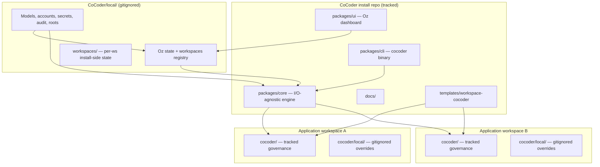

# CoCoder Architecture

**Status:** v0.1 release candidate  
**Last verified:** 2026-05-29 (package topology, language/validation policy, and ADR citations reconciled against the v2 rebuild codebase and `cocoder/rebuild/decisions/`)

## Mental Model

CoCoder has **four storage zones** that must never be conflated. Two live in the CoCoder install repo; two live in any application repo where a user runs `cocoder init`.



| Zone | Location | Tracked in git? | Purpose |
|------|----------|-----------------|---------|
| **Install (public)** | CoCoder clone — `packages/`, `docs/`, `templates/`, `ARCHITECTURE.md`, `README.md`, `LICENSE` | Yes | Engine (`packages/core`), CLI (`packages/cli`), Oz dashboard source (`packages/ui`), public docs |
| **Install (private)** | `<CoCoder>/local/` | **Never** (entire directory ignored) | Oz settings, workspace registry, per-workspace install-side state, models, secrets, audit logs — survives `git pull` |
| **Workspace (shared)** | `<app>/cocoder/` | Yes (committed to your app repo) | Priorities, plans, tickets, decisions, memory, standards, custom personas — community-visible |
| **Workspace (private)** | `<app>/cocoder/local/` | **Never** (entire directory ignored except `README.md` and `.gitignore`) | Per-workspace, per-machine overrides and secrets |

### Dogfood collapse (CoCoder building itself)

CoCoder is both producer of the framework and consumer of it, so the two "workspace" zones in the table above collapse into a single tracked `cocoder/` directory at the CoCoder repo root:

- `<CoCoder>/cocoder/` — the meta-project tracking how we build CoCoder (priorities, plans, tickets, decisions, memory, standards, custom personas)
- `<CoCoder>/cocoder/local/` — narrow private overrides (typically empty for OSS CoCoder)
- ADRs about the *product itself* live in `<CoCoder>/cocoder/decisions/` (rather than at repo root) because for us "product decisions" and "build decisions" are the same set

A normal CoCoder *adopter* still sees the two zones distinctly: install-zone ADRs ship in the CoCoder clone they pull; workspace-zone ADRs live in their own application repo's `cocoder/decisions/`.

### Multi-machine sync

`local/` is not in git, but it **lives inside your CoCoder folder**. Sync the CoCoder directory across machines the same way you sync any dev environment (Syncthing, iCloud Drive, a private dotfiles repo, etc.). Git updates the engine; your sync tool keeps `local/` aligned across laptops.

## Why Git Will Not Destroy User Preferences

Git only modifies **tracked** files. Ignored paths are invisible to `git pull`, `git checkout`, and `git merge`. CoCoder's safety relies on a small ignore matrix that two different repositories (the CoCoder install repo and your application repo) both enforce.

### Ignore matrix (canonical)

| Repo | Path | Status | Owner of the rule |
|---|---|---|---|
| **CoCoder install** (this repo) | `/local/` | Ignored (entire directory; install-level state) | Root `.gitignore` in CoCoder install |
| **CoCoder install** (this repo) | `/cocoder/local/` | Ignored except `README.md` and `.gitignore` (dogfood narrow-private zone) | `cocoder/local/.gitignore` (`*` + `!.gitignore` + `!README.md`) |
| **CoCoder install** (this repo) | `/cocoder/` (everything except `cocoder/local/*`) | **Tracked** — community-visible priorities, plans, tickets, decisions, memory, standards, custom personas | No rule needed; just *don't* add it to .gitignore |
| **Workspace template** (`templates/workspace-cocoder/`) | `cocoder/local/` (relative to the template root) | Ignore rule **inside the template**, applied when copied into a user workspace | Template's own `cocoder/.gitignore` |
| **Your application repo** (after `cocoder init`) | `cocoder/local/` | Ignored | Template's `cocoder/.gitignore` (primary) AND belt-and-braces line in user repo's root `.gitignore` added by `cocoder init` |
| Any repo | `*.env`, `.env.*`, `secrets/` | Ignored at both levels | Both root and template `.gitignore` |
| Any repo | `*.example.yaml`, `*.example.json` | **Tracked** (public reference samples) | Explicit allow — never add example files to ignore rules |

**Rule of thumb:** `local/` is the *only* private zone. Priorities, plans, tickets, decisions, memory, standards, and custom personas are all tracked and community-visible. If a tool proposes ignoring anything outside `local/`, refuse.

### Pattern

1. Ship `templates/workspace-cocoder/cocoder/.gitignore` containing:

   ```
   local/
   secrets/
   *.env
   .env.*
   ```

2. `cocoder init` appends `cocoder/local/` to the user repo's root `.gitignore` (belt-and-braces; survives even if a user deletes the inner gitignore).

3. Ship **example** files as `*.example.yaml` (tracked); real `config.yaml` lives in `local/` (untracked).

4. On `cocoder init`, copy template → workspace; never copy `local/` contents from examples (only `*.example.*` files are copied with their `.example` suffix preserved).

5. On CoCoder self-update: `git pull` updates `packages/` and `templates/`; re-run `cocoder init --merge` to pick up new *tracked* workspace files only. `--merge` is idempotent and never overwrites user-edited tracked files without explicit confirmation.

**Optional hardening:** `git update-index --skip-worktree` for specific tracked files — avoid as default; gitignore is simpler.

## Directory Layout (Target)

```
CoCoder/                          # public repository (git tracked)
├── AGENTS.md
├── ARCHITECTURE.md               # this file (product synthesis)
├── LICENSE                       # Apache-2.0
├── README.md
├── pnpm-workspace.yaml           # pnpm workspaces
├── .nvmrc                        # Node version (see .nvmrc)
├── docs/                         # public docs
├── packages/                     # seven TypeScript packages, inward-only deps (rebuild ADR-0008)
│   ├── core/                     # I/O-agnostic library: runner, composition, ports, loaders, write-scope/commit-gate, preflight (depends on nothing in the workspace)
│   ├── personas/                 # shipped BASE persona set — the single source, improved centrally (ADR-0012); leaf content pkg (depends on nothing)
│   ├── adapters/                 # per-CLI drivers + preflight (depends on core)
│   ├── session-hosts/            # SessionHost drivers (cmux) (depends on core)
│   ├── daemon/                   # Oz: DB write-conn + cmux + live runs (depends on core + adapters + session-hosts)
│   ├── cli/                      # `cocoder` binary, standalone + client modes (depends on core + adapters + session-hosts)
│   └── ui/                       # Oz dashboard (depends on core)
├── templates/install-local/      # install-zone config + secrets examples
├── templates/workspace-cocoder/  # the workspace template users get from `cocoder init`
├── examples/personas/phil-primitive-builder/                               # example custom persona
├── cocoder/                      # ← dogfood meta-project (TRACKED, community-visible)
│   ├── AGENTS.md
│   ├── PRIORITIES.md             # slim index
│   ├── SESSION_LOG.md
│   ├── priorities/[slug]/        # one folder per priority, with plans/
│   ├── plans/                    # cross-priority Playbooks (rare)
│   ├── tickets/                  # INDEX.md + open/ + closed/
│   ├── decisions/                # ALL ADRs (product + build, collapsed for CoCoder dogfood)
│   ├── memory/                   # codebase-map.md, tech-stack.md, onboarding-questions.md
│   ├── personas/custom/
│   ├── standards/
│   └── local/                    # ← narrow private overrides; only README.md + .gitignore tracked
└── local/                        # ← install-level private; ENTIRE directory gitignored
    ├── config.yaml
    ├── workspaces.json           # Oz workspace registry
    ├── workspaces/               # per-workspace install-side state (evidence, run cache, audit)
    │   └── [workspace-slug]/
    ├── roots.yaml                # multi-machine path tokens
    ├── secrets/                  # API keys, oz-token
    └── audit/oz-actions.jsonl    # Oz launch/stop audit log

<your-app>/cocoder/               # per workspace, in YOUR application repo
├── AGENTS.md
├── PRIORITIES.md                 # slim index
├── SESSION_LOG.md
├── config.yaml                   # OPTIONAL team-shared defaults (tracked); empty/absent for most adopters
├── priorities/[slug]/
├── plans/
├── tickets/
├── decisions/                    # workspace-level ADRs (about YOUR product)
├── memory/
├── personas/custom/
├── standards/
└── local/                        # GITIGNORED (except README.md + .gitignore)
    ├── config.yaml               # per-machine overrides on top of the tracked defaults above
    └── persona-overrides.json
```

## Persona Boundaries (CoCoder)

| Persona | Scope |
|---------|-------|
| **Oz** | Cross-workspace runs, settings, launch/stop, health — not product code |
| **Oscar** | Product priority orchestration inside one workspace |
| **Ian** | Ops/backoffice queue — CRM, copy, integrations |
| **Bob** | Implementation, architecture, ADRs for product code |
| **Talia** | Test layer — writes/runs automated tests, fixes failures, reports evidence |
| **Quinn** | Experience layer — exercises the running product like a user (browser/UI/scripts) |
| **Phil** | Custom/extension pattern — domain "primitives" on any project |

## Oz vs Debugger

CoBuilder's **ORCH DEBUGGER** binds to one run, collects evidence, launches Codex for orchestration repair. **Oz** generalizes that into:

- Registry of all workspaces and runs (isolated tmux namespace per workspace — see Multi-workspace below)
- Interactive dashboard (launch priority, model map, concurrency flags)
- Run Inspector (debugger evidence views)
- Settings editor for global + per-workspace overrides

The Oz daemon owns run state and evidence without forking the engine's business logic — it drives `packages/core` through the `SessionHost`/adapter ports rather than reimplementing orchestration.

## Package topology and dependency rule

The v2 rebuild is a clean build (not an extraction): the six packages already exist under `packages/`. Per [`cocoder/rebuild/decisions/0008-repository-topology.md`](./cocoder/rebuild/decisions/0008-repository-topology.md), dependencies flow inward only:

- `core` depends on nothing else in the workspace.
- `adapters`, `session-hosts`, and `ui` depend only on `core`.
- `daemon` and `cli` depend on `core` + `adapters` + `session-hosts`.

The rule is enforced by a deterministic guardrail: `node scripts/check-topology.mjs`.

## Language and validation policy

- **TypeScript across all packages.** Each package exports `./src/index.ts`; there is no `.mjs` orchestration core (the historical v1 `.mjs` plan does not apply to the rebuild).
- **No external validation library** (zod/yup/joi/ajv/valibot) is currently a dependency or imported anywhere; validation is hand-written TypeScript where needed.
- **pnpm workspaces**, Node per `.nvmrc`.

## Multi-workspace concurrency (plain language)

tmux names sessions globally on your Mac unless you isolate them. If Workspace A and Workspace B both create a session named `oscar-priority-foo`, they can collide.

**Fix:** give each registered workspace its own tmux *namespace* (a named socket, e.g. `cocoder-myapp`). Oz launches into that namespace. Sessions in one repo cannot see or kill sessions in another.

Analogy: one building (your Mac) with separate floors (workspace sockets) instead of everyone sharing one open-plan room (default tmux).

## Multi-machine path portability

`local/workspaces.json` registers workspaces by path. Absolute paths break across machines synced via Syncthing/iCloud if the same workspace lives at different roots (e.g. `/Volumes/NAS LOCAL/CoBuilder` vs `~/dev/CoBuilder`).

**Resolution:** workspace entries store one of:

1. A path under `${COCODER_HOME}` (the directory containing the CoCoder install) — portable as long as the install folder itself is synced.
2. A path under a named root in `local/roots.yaml` (e.g. `roots: { nas: "/Volumes/NAS LOCAL", dev: "~/dev" }`), used as `${root:nas}/CoBuilder`.

`cocoder` resolves these tokens at runtime. Absolute paths are only stored when neither token applies, and a warning is logged.

## Oz daemon security model

Oz runs an HTTP daemon that can launch and stop processes. It is **not** internet-exposed; the security posture protects against local-machine threats (untrusted browser tabs, malicious npm scripts, DNS rebinding):

1. Bind `127.0.0.1` only (never `0.0.0.0`).
2. Require a per-install session token (`local/secrets/oz-token`) on every state-changing endpoint.
3. Reject requests with mismatched `Origin`/`Host` headers (DNS-rebinding defense).
4. CSRF token required on `POST`/`DELETE` from the dashboard.
5. Settings endpoints never return secret values — only references (e.g. `"openai": "ref:env:OPENAI_API_KEY"`).
6. All launch/stop actions write to `local/audit/oz-actions.jsonl` with timestamp, persona, workspace, run id, and outcome.
7. No shell-string interpolation of workspace paths — argv arrays only.

## Oz improvement routing

Oz classifies every proposed improvement by target zone before making or recommending a change:

- `cocoder-product` — CoCoder source itself (`packages/`, `templates/`, public docs, shipped prompts). This is contributor-only developer-mode work.
- `workspace-shared` — the active repo's tracked `cocoder/` folder.
- `workspace-local` — the active repo's ignored `cocoder/local/` folder.
- `install-local` — the ignored `<CoCoder>/local/` install preference zone.
- `upstream-candidate` — a workspace finding that may belong upstream, but should be drafted for contributor review instead of edited into the install.

Normal adopters get workspace customization by default. CoCoder product improvements are only routed to `cocoder-product` when the active workspace is the CoCoder repo dogfood workspace and developer mode is enabled. See [`cocoder/rebuild/decisions/0008-repository-topology.md`](./cocoder/rebuild/decisions/0008-repository-topology.md) (one-home enforcement) and [`0009-extensibility.md`](./cocoder/rebuild/decisions/0009-extensibility.md).

## References

- Design language: [`docs/oz-design-brief.md`](./docs/oz-design-brief.md)
- ADR index (authoritative for v2): [`cocoder/rebuild/decisions/README.md`](./cocoder/rebuild/decisions/README.md)
- Attribution / prior art: `NOTICE`
- Dogfood meta-project: `cocoder/AGENTS.md`
- Active priorities: `cocoder/PRIORITIES.md`
