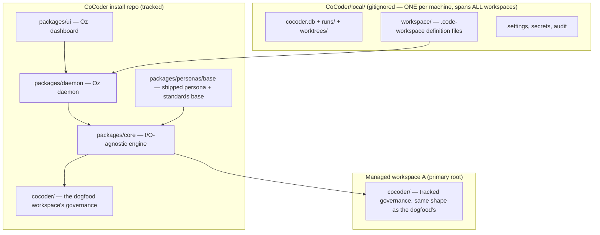

# CoCoder Architecture

**Status:** v2 (rebuild) — live  
**Last verified:** 2026-06-10 (reorg: one decisions tree, three zones, `cocoder/local/` eliminated; reconciled against `cocoder/decisions/` ADRs 0001–0019)

## Mental Model

CoCoder has **three storage zones** ([ADR-0008](./cocoder/decisions/0008-repository-topology.md), amended 2026-06-10) that must never be conflated.



| Zone | Location | Tracked in git? | Purpose |
|------|----------|-----------------|---------|
| **Install (public)** | CoCoder clone — `packages/`, `docs/`, `templates/`, `scripts/`, `cocoder/` (dogfood governance) | Yes | The engine, the shipped persona/standards base, the dashboard, public docs — and the dogfood workspace's own governance |
| **Install (private)** | `<CoCoder>/local/` | **Never** (only its signage `README.md` is tracked) | ALL machine-local state, spanning every managed workspace: the operational DB, run artifacts, per-run worktrees, workspace definition files (`local/workspace/`), settings, secrets, audit logs — survives `git pull` |
| **Workspace (tracked)** | `<primary-root>/cocoder/` | Yes (committed to that repo) | That workspace's governance: priorities, decisions, tickets, memory, standards extensions, persona extensions — community-visible |

**There is no per-workspace "local" zone.** A `cocoder/` governance directory is fully git-tracked
and never contains machine state; everything machine-specific lives in the install's one `local/`.

### The dual nature (CoCoder building itself)

The CoCoder repo is two things at once: the **engine install** every workspace shares, and the host
of one particular workspace — the **dogfood**, whose primary root is CoCoder itself. So
`<CoCoder>/cocoder/` is simply the dogfood workspace's governance directory, structurally identical
to the `cocoder/` directory any managed repo gets. For the dogfood, "product decisions" and "build
decisions" are the same set, so they share one `cocoder/decisions/` tree. An adopter's repo carries
*their* product's ADRs in *their* `cocoder/decisions/`; CoCoder's ship here.

### Multi-machine sync

`local/` is not in git, but it **lives inside your CoCoder folder**. Sync the CoCoder directory across machines the same way you sync any dev environment (Syncthing, iCloud Drive, a private dotfiles repo, etc.). Git updates the engine; your sync tool keeps `local/` aligned across laptops.

## Why Git Will Not Destroy User Preferences

Git only modifies **tracked** files. Ignored paths are invisible to `git pull`, `git checkout`, and `git merge`. CoCoder's safety relies on a small ignore matrix that two different repositories (the CoCoder install repo and your application repo) both enforce.

### Ignore matrix (canonical)

| Repo | Path | Status | Owner of the rule |
|---|---|---|---|
| **CoCoder install** (this repo) | `/local/` | Ignored (`/local/*` + `!/local/README.md` — only the signage README is tracked) | Root `.gitignore` in CoCoder install |
| **CoCoder install** (this repo) | `/cocoder/` | **Tracked, fully** — the dogfood workspace's governance | No rule needed; just *don't* add it to .gitignore |
| **Your application repo** (after init) | `cocoder/` | **Tracked, fully** — your workspace's governance | Same — never ignored, never contains machine state |
| Any repo | `*.env`, `.env.*`, `secrets/` | Ignored at both levels | Both root and template `.gitignore` |
| Any repo | `*.example.yaml`, `*.example.json` | **Tracked** (public reference samples) | Explicit allow — never add example files to ignore rules |

**Rule of thumb:** the install's `/local/` is the *only* private zone, period. Everything in a
`cocoder/` governance directory — priorities, decisions, tickets, memory, standards, persona
extensions — is tracked and community-visible. If a tool proposes ignoring anything outside the
install's `local/`, refuse.

### Pattern

1. Ship **example** files as `*.example.*` (tracked); real config lives in `local/` (untracked).
2. On init/bootstrap, copy `templates/workspace-cocoder/` → `<primary-root>/cocoder/`; nothing
   machine-local is ever written into the workspace.
3. On CoCoder self-update: `git pull` updates `packages/` and `templates/`; `local/` is invisible to
   git and survives untouched.

## Directory Layout (canonical — reorg of 2026-06-10)

```
CoCoder/                          # the engine install AND the dogfood workspace's host
├── AGENTS.md                     # repo orientation (start here)
├── ARCHITECTURE.md               # this file
├── LICENSE · README.md · pnpm-workspace.yaml · …
├── packages/                     # seven TypeScript packages, inward-only deps (ADR-0008)
│   ├── core/                     # I/O-agnostic engine: runner, personas, plays, commit-gate, store
│   ├── personas/                 # shipped BASE personas + Plays + shared-standards (ADR-0012) —
│   │                             #   the vast majority of persona behavior lives HERE
│   ├── adapters/                 # per-CLI drivers + preflight (claude, codex, cursor-agent)
│   ├── session-hosts/            # SessionHost drivers (cmux)
│   ├── daemon/                   # Oz daemon: DB write-conn + cmux + live runs + HTTP API
│   ├── cli/                      # `cocoder` binary (standalone + daemon-client modes)
│   └── ui/                       # Oz dashboard (Electron)
├── docs/                         # public docs
├── examples/                     # example custom personas etc.
├── scripts/                      # oz.sh (daemon lifecycle), check-topology.mjs
├── templates/
│   ├── install-local/            # install-zone config + secrets examples
│   └── workspace-cocoder/        # the cocoder/ scaffold a managed repo gets
├── cocoder/                      # ← the DOGFOOD workspace's governance (tracked; same shape as
│   │                             #   any <primary-root>/cocoder/ — every dir below is LIVE)
│   ├── AGENTS.md                 # meta-project routing
│   ├── PLAYBOOK.md               # the roadmap (phases + priority ordering, interim)
│   ├── SESSION_LOG.md            # append-only work log (+ SESSION_LOG_ARCHIVE.md)
│   ├── failure-catalog.md        # observed failures that earn guardrails (D2)
│   ├── decisions/                # THE one live ADR tree (0001–0019+)
│   ├── priorities/               # one flat .md per launchable priority (+ backlog/)
│   ├── tickets/                  # INDEX.md + open/ + closed/
│   ├── personas/                 # EXTENSIONS only: deltas/ + custom/ + assignments.json
│   ├── memory/                   # codebase-map, tech-stack, onboarding
│   ├── standards/                # workspace extensions of the shipped base standard
│   ├── spikes/                   # exploration notes that informed ADRs
│   └── zArchive/                 # ALL frozen history (v1 tree, v1 decisions, archived priorities)
└── local/                        # ← the ONE machine-local zone (gitignored; spans ALL workspaces)
    ├── cocoder.db                # Oz-owned operational SQLite (ADR-0003)
    ├── runs/ · worktrees/        # per-run artifacts + isolated worktrees (ADR-0015)
    ├── workspace/                # .code-workspace definition files, one per workspace (ADR-0019)
    ├── workspaces.json           # legacy registry (superseded by workspace/, ADR-0019)
    ├── settings.json · secrets/ · oz-audit.log · scratch/
    └── README.md                 # the only tracked file — zone signage

<primary-root>/                   # any repo CoCoder manages
└── cocoder/                      # that workspace's governance — IDENTICAL SHAPE to the dogfood's:
    ├── AGENTS.md · SESSION_LOG.md
    ├── decisions/ · priorities/ · tickets/ · memory/ · standards/
    └── personas/ (deltas/ + custom/ + assignments.json)
                                  # NO local/ — machine state lives only in the install's local/
```

## Persona Boundaries (CoCoder)

| Persona | Scope |
|---------|-------|
| **Oz** | Cross-workspace runs, settings, launch/stop, health — not product code |
| **Oscar** | Product priority orchestration inside one workspace |
| **Ian** | Ops/backoffice queue — CRM, copy, integrations |
| **Bob** | Implementation, architecture, ADRs for product code |
| **Talia** | Test layer — writes/runs automated tests, fixes failures, reports evidence |
| **Quinn** | Experience layer — exercises the running product like a user (browser/UI/scripts) |
| **Phil** | Custom/extension pattern — domain "primitives" on any project |

## Oz vs Debugger

CoBuilder's **ORCH DEBUGGER** binds to one run, collects evidence, launches Codex for orchestration repair. **Oz** generalizes that into:

- Registry of all workspaces and runs (isolated tmux namespace per workspace — see Multi-workspace below)
- Interactive dashboard (launch priority, model map, concurrency flags)
- Run Inspector (debugger evidence views)
- Settings editor for global + per-workspace overrides

The Oz daemon owns run state and evidence without forking the engine's business logic — it drives `packages/core` through the `SessionHost`/adapter ports rather than reimplementing orchestration.

## Package topology and dependency rule

The v2 rebuild is a clean build (not an extraction): the six packages already exist under `packages/`. Per [`cocoder/decisions/0008-repository-topology.md`](./cocoder/decisions/0008-repository-topology.md), dependencies flow inward only:

- `core` depends on nothing else in the workspace.
- `adapters`, `session-hosts`, and `ui` depend only on `core`.
- `daemon` and `cli` depend on `core` + `adapters` + `session-hosts`.

The rule is enforced by a deterministic guardrail: `node scripts/check-topology.mjs`.

## Language and validation policy

- **TypeScript across all packages.** Each package exports `./src/index.ts`; there is no `.mjs` orchestration core (the historical v1 `.mjs` plan does not apply to the rebuild).
- **No external validation library** (zod/yup/joi/ajv/valibot) is currently a dependency or imported anywhere; validation is hand-written TypeScript where needed.
- **pnpm workspaces**, Node per `.nvmrc`.

## Multi-workspace concurrency (plain language)

tmux names sessions globally on your Mac unless you isolate them. If Workspace A and Workspace B both create a session named `oscar-priority-foo`, they can collide.

**Fix:** give each registered workspace its own tmux *namespace* (a named socket, e.g. `cocoder-myapp`). Oz launches into that namespace. Sessions in one repo cannot see or kill sessions in another.

Analogy: one building (your Mac) with separate floors (workspace sockets) instead of everyone sharing one open-plan room (default tmux).

## Multi-machine path portability

`local/workspaces.json` registers workspaces by path. Absolute paths break across machines synced via Syncthing/iCloud if the same workspace lives at different roots (e.g. `/Volumes/NAS LOCAL/CoBuilder` vs `~/dev/CoBuilder`).

**Resolution:** workspace entries store one of:

1. A path under `${COCODER_HOME}` (the directory containing the CoCoder install) — portable as long as the install folder itself is synced.
2. A path under a named root in `local/roots.yaml` (e.g. `roots: { nas: "/Volumes/NAS LOCAL", dev: "~/dev" }`), used as `${root:nas}/CoBuilder`.

`cocoder` resolves these tokens at runtime. Absolute paths are only stored when neither token applies, and a warning is logged.

## Oz daemon security model

Oz runs an HTTP daemon that can launch and stop processes. It is **not** internet-exposed; the security posture protects against local-machine threats (untrusted browser tabs, malicious npm scripts, DNS rebinding):

1. Bind `127.0.0.1` only (never `0.0.0.0`).
2. Require a per-install session token (`local/secrets/oz-token`) on every state-changing endpoint.
3. Reject requests with mismatched `Origin`/`Host` headers (DNS-rebinding defense).
4. CSRF token required on `POST`/`DELETE` from the dashboard.
5. Settings endpoints never return secret values — only references (e.g. `"openai": "ref:env:OPENAI_API_KEY"`).
6. All launch/stop actions write to `local/audit/oz-actions.jsonl` with timestamp, persona, workspace, run id, and outcome.
7. No shell-string interpolation of workspace paths — argv arrays only.

## Oz improvement routing

Oz classifies every proposed improvement by target zone before making or recommending a change:

- `cocoder-product` — CoCoder source itself (`packages/`, `templates/`, public docs, shipped prompts + base personas). This is contributor-only developer-mode work; in the dogfood it's the portability-test call (ADR-0012).
- `workspace-shared` — the active repo's tracked `cocoder/` governance folder.
- `install-local` — the ignored `<CoCoder>/local/` machine-state zone (the only local zone).
- `upstream-candidate` — a workspace finding that may belong upstream, but should be drafted for contributor review instead of edited into the install.

Normal adopters get workspace customization by default. CoCoder product improvements are only routed to `cocoder-product` when the active workspace is the CoCoder repo dogfood workspace and developer mode is enabled. See [`cocoder/decisions/0008-repository-topology.md`](./cocoder/decisions/0008-repository-topology.md) (one-home enforcement) and [`0009-extensibility.md`](./cocoder/decisions/0009-extensibility.md).

## References

- Design language: [`packages/ui/design-ref/`](./packages/ui/design-ref/) — the authoritative Oz V1 design (the preserved claude.ai/design prototype). `docs/oz-design-brief.md` is only the historical *input brief*, not the design.
- ADR index (authoritative for v2): [`cocoder/decisions/README.md`](./cocoder/decisions/README.md)
- Attribution / prior art: `NOTICE`
- Dogfood meta-project: `cocoder/AGENTS.md`
- Roadmap + active priorities: `cocoder/PLAYBOOK.md` + the `cocoder/priorities/*.md` listing
